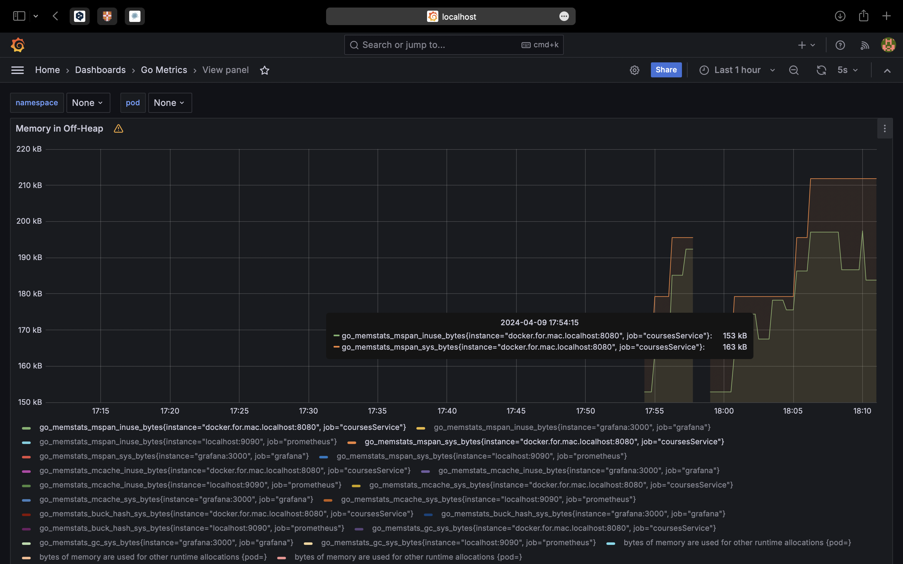
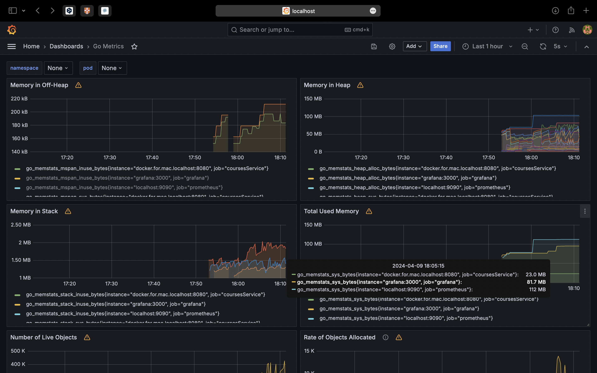
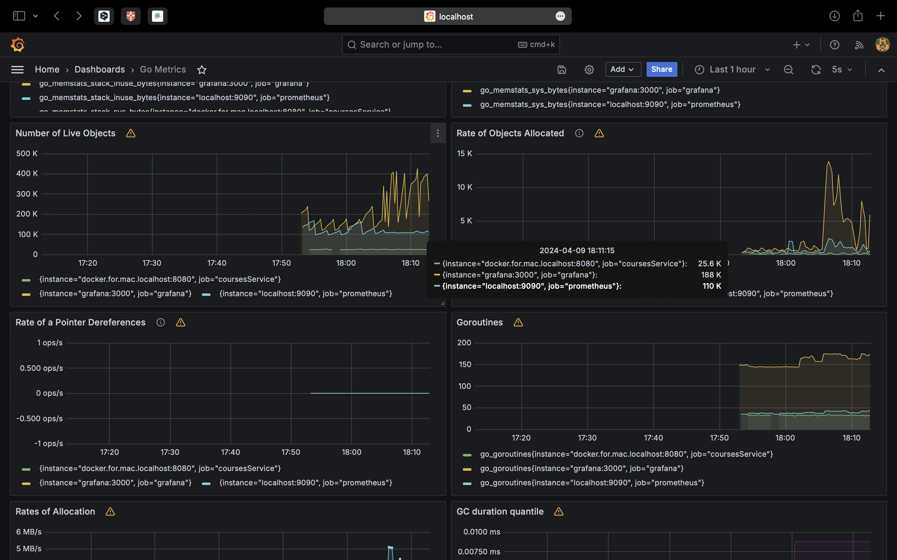

# Courses service
# Киселев Иван

В проекте
- Чистая архитектура и
  Проработанный по best practice project layout
- Трассировка c использованием open telemetry и jaeger
- Настроенные Prometheus и Grafana
- Тщательно проработанная OpenAPI спецификация API сервиса, которая используется для генерации клиентов и сервера
- Настраиваемый логгер, передающийся через контекст, что упрощает тестирование
- Библиотека для работы с ошибками в REST сервисе, облегчающая дебагинг и скрывающая чувствительные данные от end user
- MongoDB с репликами, повышающие целевое значение доступности сервиса
- Написанные consumer/producer клиенты Кафки с возможностью легко интегрировать работу с MQ. Возможность подключиться к кафке локально (не из docker)
- Интеграция легковесного демона (daemon) — scraper, с которым можно будет легко запустить фоновую процедуру с бизнес логикой из уже реализованного домена

На каждый слой были сделаны свои модели и конвертеры.

Также были использованы другие общие библиотеки вынесенные в pkg
- xshutdown: graceful shutdown библиотека включающая в себя безопасное создание callback’а из любой точки приложение, детальную настройку тайм-аутов, возможность обработки ошибок и force shutdown
-  xconfig: инструмент переписывающий yaml конфиги переменными из env, используя рефлексию

Структура этого сервиса соответствует общему шаблону для сервисов на Go. 

Оформление коммитов выбрано для удобного ручного просмотра и согласно конвенциям

Grafana и Метрики из Prometheus:

